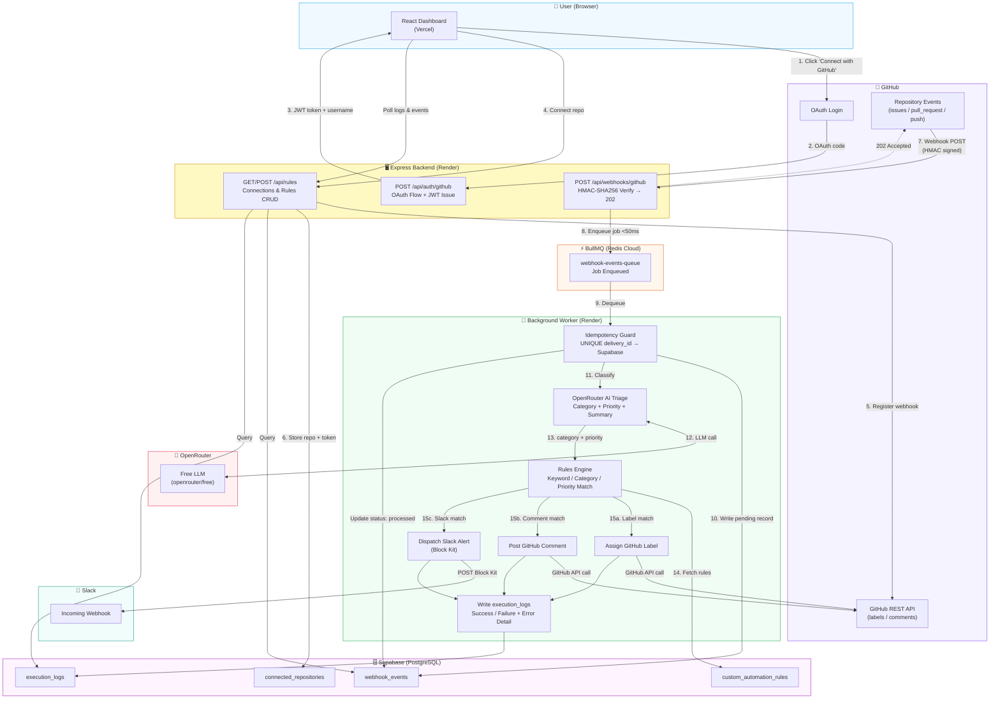
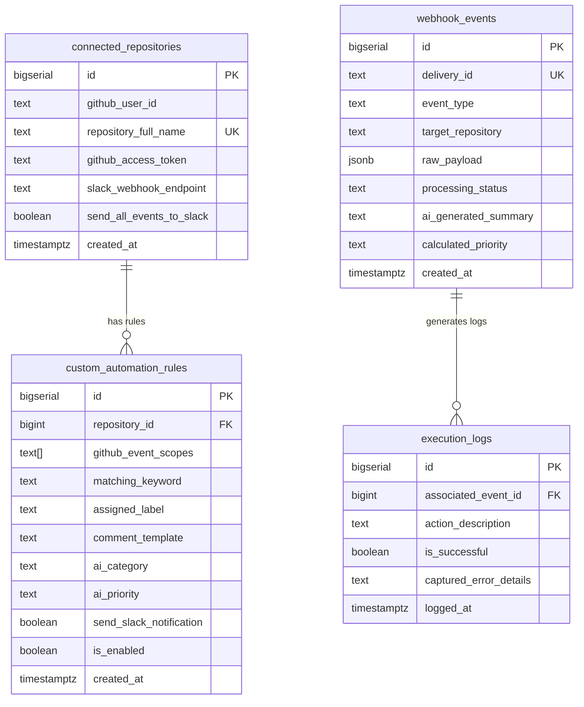

# GitHub Automation Console

An event-driven GitHub automation platform. Connect a repository, define rules, and let the bot automatically triage issues/PRs with AI, assign labels, post comments, and fire Slack alerts — all within 50ms of a webhook arriving.

---

## What It Does

| Capability | Detail |
|---|---|
| **GitHub OAuth Login** | Users sign in with GitHub; the backend exchanges a code for an access token and issues a short-lived JWT |
| **Repository Connection** | Registers a GitHub webhook (`issues`, `pull_request`, `push`) on any repo the user owns, pointing to this backend |
| **Webhook Ingestion** | Verifies HMAC-SHA256 signature, then enqueues the event via BullMQ (<50ms) and responds `202 Accepted` |
| **AI Triage** | Background worker calls OpenRouter to classify issues/PRs into `bug`, `feature`, `documentation`, `refactoring`, or `support`, plus a priority level |
| **Custom Rules Engine** | Users create rules that match on event type, keyword, AI category, or AI priority — rules can assign GitHub labels, post automated comments, and/or trigger Slack notifications |
| **Slack Alerts** | Formatted Block Kit payloads sent to a configured Slack Incoming Webhook URL |
| **Execution Audit Log** | Every action (label assigned, comment posted, Slack dispatched) is persisted with success/failure status and error traces |
| **Idempotency** | Postgres unique constraint on `delivery_id` prevents any event from being processed twice, even on GitHub retries |

---

## Architecture

### System Flow



### Database Schema



---

## Local Setup

### Prerequisites

- Node.js 18+
- A running Redis instance (local or Redis Cloud free tier)
- A Supabase project (free tier)
- A GitHub OAuth App
- An OpenRouter account (free tier works)
- A Slack Incoming Webhook URL (optional, for Slack notifications)
- A public tunnel for local development (e.g. [Cloudflare Tunnel](https://developers.cloudflare.com/cloudflare-one/connections/connect-networks/get-started/) or ngrok) — GitHub needs to reach your local server

### 1. Clone and install

```bash
git clone https://github.com/mk-ctrl/abstrabit.assessment.git
cd abstrabit.assessment

# Install backend dependencies
cd backend
npm install

# Install frontend dependencies
cd ../frontend
npm install
```

### 2. Configure environment variables

Copy the example file and fill in your values:

```bash
cd backend
cp .env.example .env
```

See the [Environment Variables](#environment-variables) section below for what each value means.

### 3. Set up the Supabase database

Run the following SQL in your Supabase SQL editor to create the required tables:

```sql
-- Connected repositories
CREATE TABLE connected_repositories (
  id BIGSERIAL PRIMARY KEY,
  github_user_id TEXT NOT NULL,
  repository_full_name TEXT NOT NULL UNIQUE,
  github_access_token TEXT NOT NULL,
  slack_webhook_endpoint TEXT,
  send_all_events_to_slack BOOLEAN DEFAULT true,
  created_at TIMESTAMPTZ DEFAULT now()
);

-- Incoming webhook event ledger
CREATE TABLE webhook_events (
  id BIGSERIAL PRIMARY KEY,
  delivery_id TEXT NOT NULL UNIQUE,
  event_type TEXT NOT NULL,
  target_repository TEXT NOT NULL,
  raw_payload JSONB,
  processing_status TEXT DEFAULT 'pending',
  ai_generated_summary TEXT,
  calculated_priority TEXT,
  created_at TIMESTAMPTZ DEFAULT now()
);

-- Custom automation rules
CREATE TABLE custom_automation_rules (
  id BIGSERIAL PRIMARY KEY,
  repository_id BIGINT REFERENCES connected_repositories(id) ON DELETE CASCADE,
  github_event_scopes TEXT[] NOT NULL,
  matching_keyword TEXT,
  assigned_label TEXT,
  comment_template TEXT,
  ai_category TEXT DEFAULT 'any',
  ai_priority TEXT DEFAULT 'any',
  send_slack_notification BOOLEAN DEFAULT false,
  is_enabled BOOLEAN DEFAULT true,
  created_at TIMESTAMPTZ DEFAULT now(),
  CONSTRAINT valid_event_scope CHECK (
    github_event_scopes <@ ARRAY['issues', 'pull_request', 'push']
  )
);

-- Execution audit log
CREATE TABLE execution_logs (
  id BIGSERIAL PRIMARY KEY,
  associated_event_id BIGINT REFERENCES webhook_events(id) ON DELETE CASCADE,
  action_description TEXT,
  is_successful BOOLEAN,
  captured_error_details TEXT,
  logged_at TIMESTAMPTZ DEFAULT now()
);
```

### 4. Create a GitHub OAuth App

1. Go to **GitHub → Settings → Developer settings → OAuth Apps → New OAuth App**
2. Set **Homepage URL** to `http://localhost:5173`
3. Set **Authorization callback URL** to `http://localhost:3000/api/auth/github/callback`
4. Copy the **Client ID** and generate a **Client Secret**

### 5. Start a public tunnel

GitHub needs to reach your local backend to deliver webhooks:

```bash
# Using Cloudflare Tunnel (one-time binary download)
./cloudflared.exe tunnel --url http://localhost:3000

# Or using ngrok
ngrok http 3000
```

Copy the public URL (e.g. `https://abc123.trycloudflare.com`) and set it as `BACKEND_PUBLIC_URL` in your `.env`.

### 6. Run the servers

```bash
# Terminal 1 — Backend
cd backend
npm run dev

# Terminal 2 — Frontend
cd frontend
npm run dev
```

Frontend runs at `http://localhost:5173`, backend at `http://localhost:3000`.

---

## Environment Variables

### Backend (`backend/.env`)

| Variable | Description |
|---|---|
| `PORT` | Port for the Express server (default: `3000`) |
| `SUPABASE_URL` | Your Supabase project URL (e.g. `https://xyz.supabase.co`) |
| `SUPABASE_KEY` | Supabase `service_role` key (has full DB access — keep secret) |
| `GITHUB_CLIENT_ID` | GitHub OAuth App Client ID |
| `GITHUB_CLIENT_SECRET` | GitHub OAuth App Client Secret |
| `GITHUB_REDIRECT_URI` | Must match your OAuth App's callback URL exactly |
| `GITHUB_WEBHOOK_SECRET` | A random secret used to sign and verify GitHub webhook payloads — generate with `openssl rand -hex 20` |
| `BACKEND_PUBLIC_URL` | Publicly reachable URL of this backend (used when registering webhooks on GitHub) |
| `REDIS_URL` | Redis connection string (e.g. `redis://127.0.0.1:6379` locally, or Redis Cloud URL in production) |
| `OPENROUTER_API_KEY` | OpenRouter API key for AI triage ([openrouter.ai](https://openrouter.ai)) |
| `JWT_SECRET` | Secret used to sign JWT session tokens — generate with `openssl rand -hex 32` |
| `FRONTEND_URL` | The deployed frontend URL (used for OAuth redirects, e.g. `http://localhost:5173` locally) |

### Frontend (`frontend/.env`)

| Variable | Description |
|---|---|
| `VITE_API_URL` | Full URL to the backend API, e.g. `http://localhost:3000/api` |

---

## Deployment

### Backend — Render (Web Service)

1. Create a new **Web Service** on [Render](https://render.com)
2. Connect the GitHub repo, set **Root Directory** to `backend`
3. **Build Command:** `npm install`
4. **Start Command:** `npm start`
5. Add all backend environment variables from the table above in the **Environment** tab
6. Set `BACKEND_PUBLIC_URL` to your Render service URL (e.g. `https://your-service.onrender.com`)
7. Set `GITHUB_REDIRECT_URI` to `https://your-service.onrender.com/api/auth/github/callback`

> **Important:** The `GITHUB_WEBHOOK_SECRET` value on Render **must exactly match** the secret configured in the GitHub webhook. When you connect a repo through the dashboard, the backend registers the webhook using the `GITHUB_WEBHOOK_SECRET` from Render's environment — so they stay in sync automatically.

### Frontend — Vercel

1. Import the repo on [Vercel](https://vercel.com), set **Root Directory** to `frontend`
2. Add environment variable: `VITE_API_URL=https://your-render-service.onrender.com/api`
3. Deploy — Vercel handles the Vite build automatically

### Redis — Redis Cloud

Use the free tier at [Redis Cloud](https://redis.com/try-free/). Set the connection string as `REDIS_URL` on Render.

### Database — Supabase

Use the free tier at [Supabase](https://supabase.com). Run the SQL schema above in the SQL editor.

---

## Live Demo

| Service | URL |
|---|---|
| **Frontend** | https://abstrabit-assessment.vercel.app |
| **Backend API** | https://abstrabit-assessment.onrender.com |

> **Note:** The backend is on Render's free tier and may take ~50 seconds to wake up after inactivity on the first request.

---

## Testing It

### Option A — Use the live demo (easiest)

1. Go to **https://abstrabit-assessment.vercel.app**
2. Click **Connect with GitHub** — you'll authorize via your own GitHub account
3. Once logged in, click **Connect Repository** and select any repo you own (or use a throwaway test repo)
4. Open a new GitHub Issue on that repo — within seconds you should see it appear in the **Execution Audit Stream** and receive a Slack alert (if a Slack webhook is configured under Settings)

### Option B — Point the webhook at a test repo

1. Create a throwaway public repo on GitHub (e.g. `yourname/webhook-test`)
2. Log in to the live demo and connect that repo — the backend will register the webhook automatically
3. Open Issues, create Pull Requests, or push commits to trigger events
4. Watch the dashboard update in real-time (auto-refreshes every 15 seconds)

### Testing Rules

1. In the dashboard, go to the **Rules** tab and click **New Rule**
2. Select event scope (`issues`, `pull_request`, or `push`)
3. Optionally set a keyword, AI category filter, or label to assign
4. Enable **Send Slack Notification** if you have a webhook configured
5. Open an issue matching your rule's criteria and watch it execute

### Verifying Webhook Delivery

Go to your GitHub repo → **Settings → Webhooks** → click your webhook → **Recent Deliveries** to see raw request/response logs for every event.
